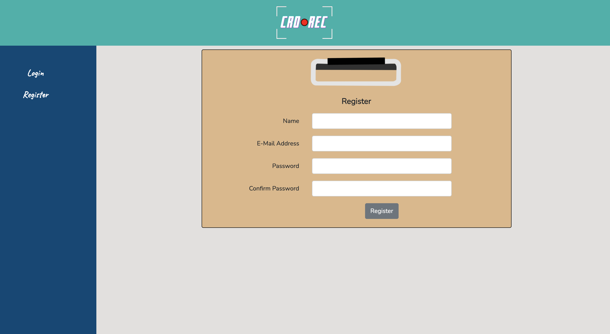
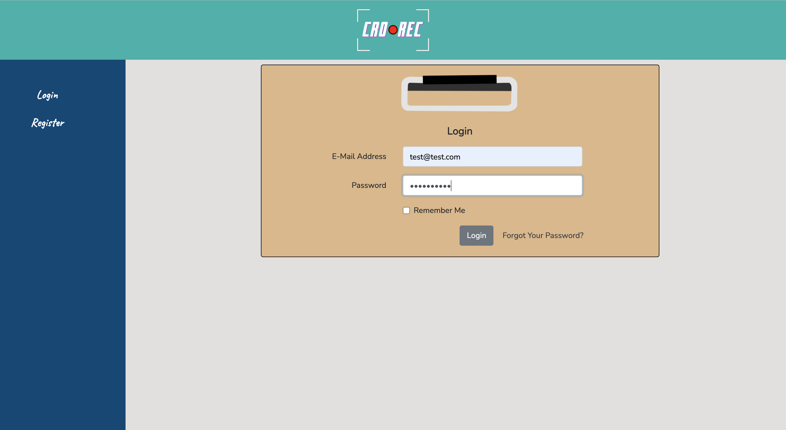
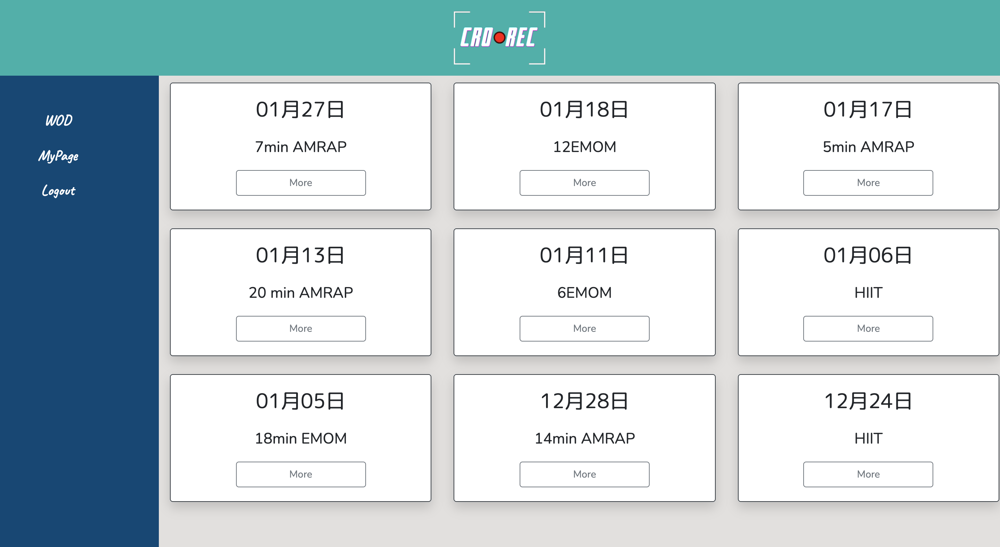
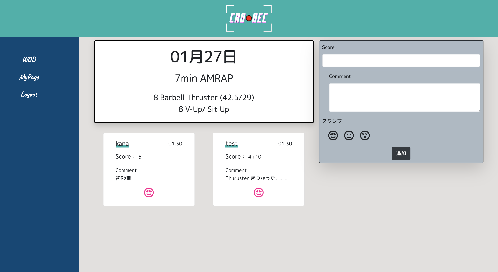
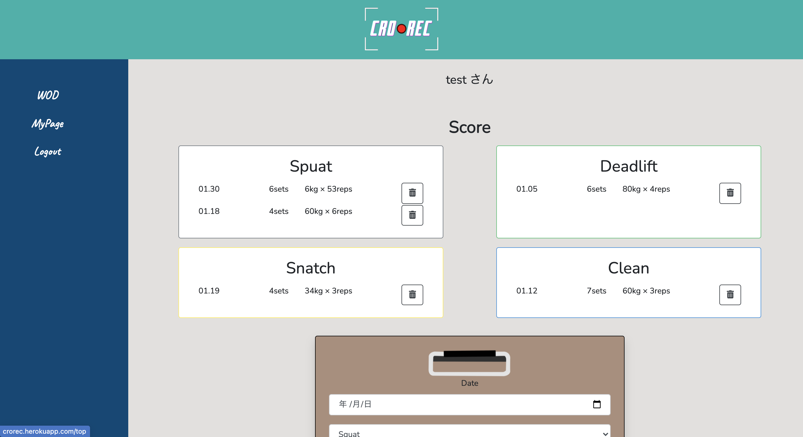
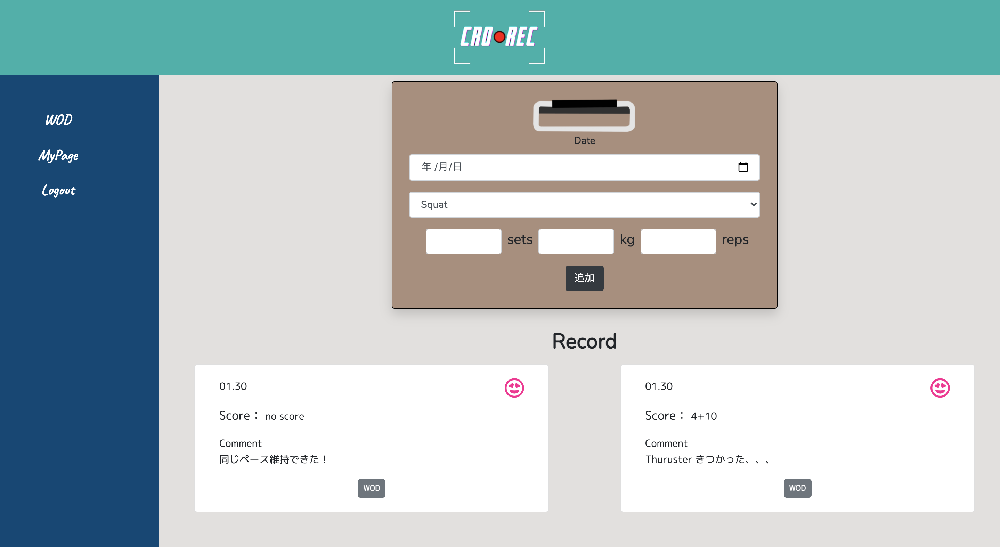

# タイトル
CRO REC  
# 使用言語
Laravel
# 作成期間
約1ヶ月

# アプリ概要
CrossFitのメニューに対する記録、
Spuat、Deadlift、Snatch、Cleanのセット数、重さ、回数の記録ができます。
 
CrossFitのメニューに対する記録は他のユーザーのデータも見ることができるので、目標設定に使用できます。

# URL
http://crorec.herokuapp.com/login

# 作成の目的・背景
私がCrossFitをやっており、メニューに対する記録をノートに書き込んでいたが、記録できるアプリがあったら便利だと考え作成しました。

# テストアカウント
メールアドレス：test@test.com  
パスワード：1234567890

# 新規登録・ログイン

# トップページ

# メニューページ

# マイページ
マイページでは、メニューに対して残した記録も表示されます。

